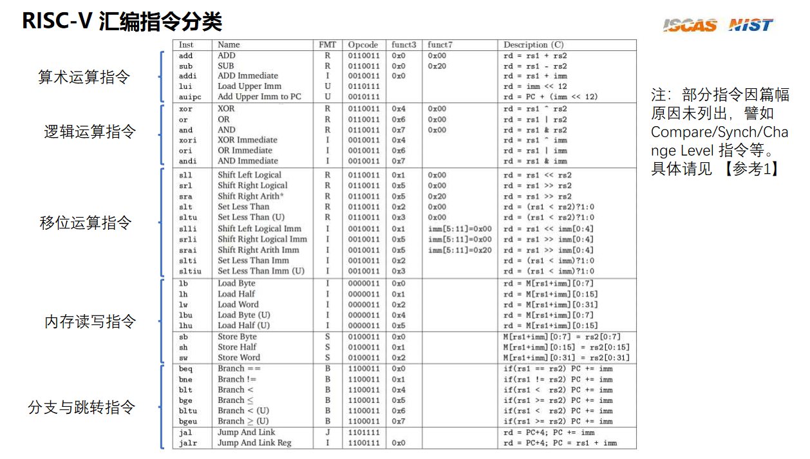

# TASK3

本人有幸学过一点点的基础底层知识 栈寄存器rbp rsp 大小端序  x86指令集（所以这部分把B站的中科院软件所的视频2倍速看了一遍（

下面就随便记录一些自己的理解（

## 大小端序

一般的PC计算机都采取小端序处理，所以如果我们储存一段数字，例如一段int类型数组的数据0xAA,0xBB，0xCC

你会在内存空间里面发现 他实际储存的地址是这样子 AA 00 00 00 BB 00 00 00 CC 00 00 00，和我们的常理完全反过来了，为什么要这样设置，原因就是因为小端序处理的话，更加容易对齐数据，方便根据地址取出( )

## 栈和堆

栈有个栈顶寄存器rsp 栈底寄存器rbp，用来记录调用函数时的栈帧的变化，当你调用一个新的函数的时候，rsp会先减去一段空间，为储存新函数的参数留空间，然后再执行push rbp之后move rbp，rsp，把rbp的地址记录下来之后，把rbp提到rsp的位置上，创造新的栈帧

## 寄存器

其实感觉RSIC-V里面的寄存器和x86中的作用其实大差不差？a0寄存器对应的是x86里面的eax寄存器，a1寄存器对应的是ebx寄存器


linux下的RSIC-V指令

```bash
riscv64-unknown-elf-gcc -S -o test.s test.c
```

```bash
riscv64-unknown-elf-gcc -o test.o -c test.s
```

```bash
riscv64-unknown-elf-gcc -o test test.o [library.c] -lm
```

```bash
qemu-riscv64 test [< test.in]
```

附上一张运行成功的截图


（然后把常见的RSIC-V汇编看看，记忆一下常见的就行（以后遇到不常见的或者不会的问问GPT



## 下面给出一段冒泡排序的RISC-V汇编

(其实就是首先要把冒泡排序的过程看懂，是有两层循环，然后汇编只是把每个步骤给拆成了具体的对数字进行操作，看懂流程，然后通过label不断地跳转就可以模仿出来汇编的执行流程)

```assembly
main:
    la x10, array 
    li x11, size      
    # 初始化外层循环，i = 0
    li x12, 0

outer_loop:
    blt x12, x11, inner_loop_start  # 如果i < n，跳转到内层循环
    j end_sort  # 否则结束排序

inner_loop_start:
    # 初始化内层循环，j = i
    mv x13, x12
    # 内层循环开始
inner_loop:
    addi x14, x13, 1  # j+1
    blt x14, x11, compare  # 如果j < n-1，比较array[j]和array[j+1]
    j end_inner_loop

compare:
    slli x15, x13, 2  # x15 = j * 4
    add x15, x10, x15  # x15 = array + j * 4
    lw x16, 0(x15)  # x16 = array[j]
    lw x17, 4(x15)  # x17 = array[j+1]

    bge x16, x17, no_swap  # 如果array[j] >= array[j+1]，不交换
    sw x16, 4(x15)  # array[j+1] = array[j]
    sw x17, 0(x15)  # array[j] = array[j+1]

no_swap:
    addi x13, x13, 1  # j++
    j inner_loop

end_inner_loop:
    addi x12, x12, 1  # i++
    j outer_loop

end_sort:
```

