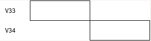

# TASK5

## 前置知识：需要了解变量的活性分析

### 活性分析的定义：(目的就是求后面还有谁用这个变量)


### 活性分析的用途(跟后面要学的图着色算法有关，很依赖于判断寄存器活性)


小例子


### How to 活性分析？


### Code（总之就是一直while循环，直到in[]和out[]集合不变


### 当图片出现了多个分支，这个时候我们就可能需要多次循环遍历来找到他的活性区间


### 小结  


学习完活性分析于是我们可以爽爽的开始学图着色算法力

## 寄存器分配的介绍

为什么要寄存器分配，就是因为我们在中端时候假设寄存器是无限多个，但是实际的汇编指令里面寄存器并没有这么多，于是需要根据活性区间来重新对其进行分配。


下图中就是对前面活性分析中的例子的应用


左边的代码中，变量b和变量c的活跃区间并不相同，所以可以共用一个寄存器。于是我们可以在代码第3行中，将变量b对应的寄存器进行加3的操作，然后直接把这个寄存器认为是c对应的寄存器。

简单的历史介绍，接下来开始爽爽的学**图着色**算法


## 图着色算法

### 概览


### 第一步:活性分析


### 第二步:画出RIG（两个变量同时出现在一个集合中，就要链接一条边）


### 第三步：对RIG进行着色


这里的观察3里面的第三条是为什么呢？

可以这样想想，因为删除的节点t的邻居小于k，那么他的邻居的颜色种类最多为k-1种，最少会留出一种颜色给t节点染上。


### 第四步：将无法分配寄存器的变量溢出

上文的第三步我们提到，要选择一个邻居数量小于k的节点，但是如果我们寄存器的数量特别少，k特别小，这个时候找不到邻居数量小于k的节点。那我们就只能采取溢出到内存了。


我们这里将邻居最多的f删除，因为他产生的冲突最多


然后我们继续根据图着色算法，从栈里面一步步恢复，到f这个节点的时候，产生了两种可能的情况

第一种是乐观着色法，第二种就是只能溢出到内存里面了。（显然这里是第二种情况，那我们继续看空溢出到内存里面怎么办


关于f变量的指令就变成了load store有关，f这个时候就储存在内存里面而不是寄存器，并且他的活跃情况也减少了。


## 合并

看了一遍论文，发现还是需要很多的前置知识才能看得懂（

于是通过在看虎书和看b站把这个部分学了一下（

合并这个概念产生于一种特殊的情况，当两个变量的活性区间(live interval)如果正好他的开始和结束恰好在一起，那么算不算冲突呢？



这样就会产生两种情况：

一种是可以使用相同寄存器的：

eg：

```
ADD [V32|I] [V33|I] [V34|I]
```

r1 = V32 + r1，我们可以直接使用相同的寄存器规避冲突

第二种就是移动关联的关系：

```
MOVE [V33|I] [V34|I] 
```

 ，假设`V34`分配了`$t0`寄存器，`V33`分配了`$t0`寄存器，上面的语句翻译为mips汇编：

```
move $t0, $t0
```

这种关系被称为移动关联（move-related），在图中可以使用虚线表示，也就是在上图中所展示的一样，move-realated的结点使用了虚线进行连接，move-related的两个结点事实上时可以合并为一个的，也就是两者会被染上同一个颜色。

## 移动关联区间合并

对move-related的结点进行合并的动作叫做interval coalescing，区间合并，结果是两个区间进行组合变成了一个区间，不过将interval进行合并会导致产生一个生命周期更加长的interval，从而对寄存器分配造成压力产生更多的spill，如果因为删掉一个复制语句而新增spill就得不偿失了，因为访存速度会慢很多。


在上图中，新产生的`V33&V34`有的冲突数量增多了。

所以在进行折叠之前需要一些判断，比如说使用briggs的conservative heuristic：如果合并之后产生了结点N，N的邻居中，度大于等于R的邻居数量少于R个，那么合并时安全的，不会将可着色的图转为不可着色的图。这是因为，对于N的邻居来说，度只可能时减小或者不变，由于度大于等于R的邻居少于R个，那么N也是可简化的，也就没有给N的邻居带来新增的不可简化的邻居。

如果一个结点有move-related的邻居，但是不能进行合并，那么将这个结点进行freeze操作，放弃进行合并，也就是和这个结点有move-related关系的结点不再有move-related关系，在接下来的处理中使用其他的处理方式来处理这个结点：


并不是每一对move-related的结点都可以被合并，如果两者之间存在了move-related又存在冲突，那么这被称为受限的（constrained）。考虑一个图有x,y,z三个结点：


其中，x和z冲突，x和y、y和z存在move-related关系，在进行了x和y合并之后，情况就会变成：


这种情况是无法进行合并的，所以将这里的move-related关系忽略掉，而是进一步进行简化，将`x&y`或者`z`取走。

## 合并策略

上文提到如果我们盲目合并的话，可能就不是K色着色了，所以下面提出两种算法，确保安全才进行合并，这里就贴一下虎书上面的图。


先build，如果能simplify就一直循环，把节点不断push入栈种，直到无法simplify，就开始coalesce，合并之后再尝试simpilify，如果无法coalesce，就进行freeze后重新跳回到simplify，如果无法freeze就直接把变量放入栈中先溢出，然后再进行select染色，如果发生了actual spill溢出，就记录一下然后再select染色。最后检测如果有actual spill再重建一个图，直到没溢出。

